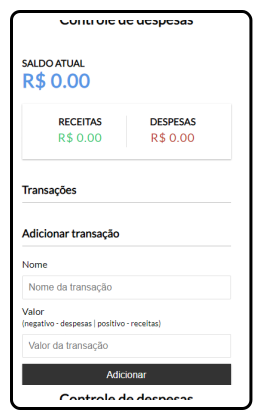
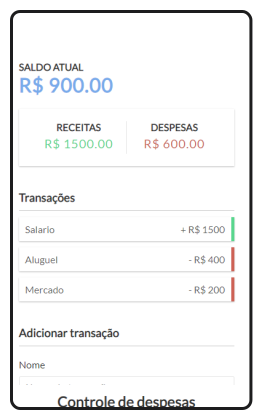

<h1 align="center">Controle de despesas com JavaScript </h1>

<h1 align="center">
 
</h1>

## 🔖 Sobre

## 🚀 Tecnologias usadas

- HTML5;
- CSS3;
- JavaScript;

---

## ♻️ Como contribuir
Contribuições são o que fazem a comunidade open-source um lugar incrível. Qualquer contribuição que você fizer neste projeto será **muito apreciada.**

- Fork esse repositório;
- Crie uma branch com a sua feature: ```git checkout -b my-feature```
- Commit suas mudanças: ```git commit -m 'feat: My new feature'```
- Push a sua branch: ```git push origin my-feature```
- Abra uma Pull Request
---
## 📝 Licença
Esse projeto está sob a licença MIT. Veja o arquivo [LICENSE](https://github.com/HenriqL/Controle-de-despesas-em-JS/blob/master/LICENSE) para mais detalhes.